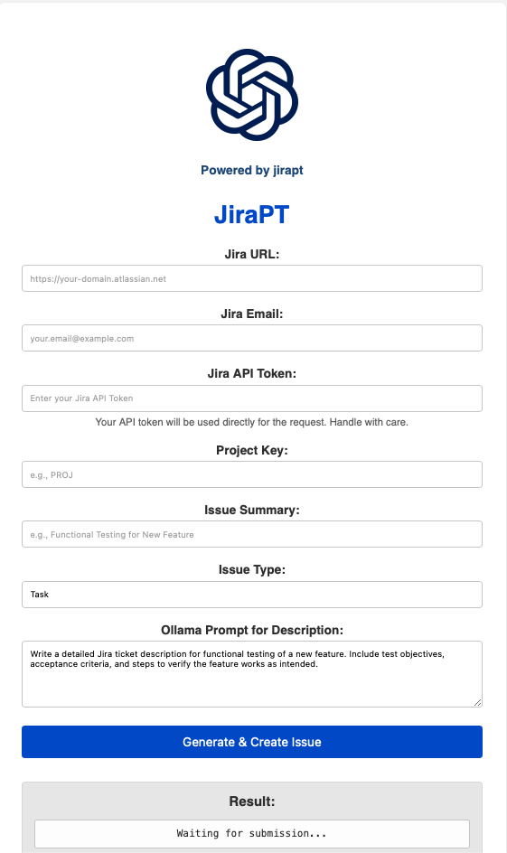

# Jira Issue Creator with Ollama

This Flask application provides a web interface to create Jira issues (Tasks, Epics, etc.) with descriptions automatically generated by a local Ollama instance.

## Features

- Simple web form to input Jira details (URL, Email, API Token, Project Key, Summary, Issue Type).
- Uses a user-provided prompt to generate a detailed issue description via Ollama.
- Connects to your specified local or network-accessible Ollama instance.
- Creates the issue in your Jira project using the provided credentials and generated description.

## Setup and Installation

Follow these steps to set up and run the application on your local machine:

1.  **Prerequisites:**
    *   Python 3.7+ installed.
    *   `pip` (Python package installer) installed.
    *   Ollama installed and running on your machine or accessible on your network. Ensure the model you intend to use (e.g., `orca-mini`) is pulled (`ollama pull orca-mini`).
    *   Git (optional, for cloning).

2.  **Download the Application:**
    *   Extract the `jira_creator_app.zip` file provided.
    *   Alternatively, if you have Git, you can clone the repository (assuming it was put in one).

3.  **Navigate to Project Directory:**
    Open your terminal or command prompt and change directory into the extracted `jira_creator_app` folder:
    ```bash
    cd path/to/jira_creator_app
    ```

4.  **Create and Activate Virtual Environment:**
    It is highly recommended to use a virtual environment to manage dependencies.
    ```bash
    # Create virtual environment (use python3 if python points to Python 2)
    python -m venv venv

    # Activate virtual environment
    # On Windows:
    .\venv\Scripts\activate
    # On macOS/Linux:
    source venv/bin/activate
    ```
    You should see `(venv)` at the beginning of your terminal prompt.

5.  **Install Dependencies:**
    Install the required Python libraries from `requirements.txt`:
    ```bash
    pip install -r requirements.txt
    ```

6.  **Configure Ollama Host:**
    *   Find the `.env.example` file in the project directory.
    *   Rename it or create a copy named `.env`.
    *   Edit the `.env` file and set the `OLLAMA_HOST` variable to the correct URL (including `http://` or `https://` and the port) where your Ollama instance is running. For example:
        ```
        OLLAMA_HOST=http://localhost:11434
        ```
        or if Ollama is on another machine on your network:
        ```
        OLLAMA_HOST=http://192.168.1.50:11434
        ```

## Running the Application

1.  **Ensure Ollama is Running:** Make sure your Ollama service is active and accessible at the URL specified in your `.env` file.

2.  **Start the Flask Server:**
    While in the `jira_creator_app` directory with the virtual environment activated, run:
    ```bash
    python src/main.py
    ```
    The server will start, typically listening on `http://127.0.0.1:8000/` or `http://0.0.0.0:8000/`.

3.  **Access the Web Interface:**
    Open your web browser and navigate to `http://127.0.0.1:8000/` (or the URL shown in the terminal).

4.  **Create Jira Issue:**
    *   Fill in your Jira instance URL, email, API token, project key, issue summary, and issue type.
    *   Modify the Ollama prompt if desired.
    *   Click "Generate & Create Issue".
    *   The application will contact your Ollama instance to generate the description and then create the issue in Jira.
    *   The result (success or error, including the Jira issue link if successful) will be displayed on the page.

## Notes

*   **Security:** Your Jira API token is sent from your browser to the local Flask application. Ensure you trust the environment where you run this application.
*   **Ollama Model:** The application currently defaults to using the `llama3.2` model. If you want to use a different model, you will need to edit the `model='llama3.2'` part in the `src/main.py` file (around line 76) and ensure that model is available in your Ollama instance.
*   **Error Handling:** Basic error handling is included for connection issues with Ollama and Jira, and for missing fields. Check the terminal where `python src/main.py` is running for detailed logs if you encounter issues.

